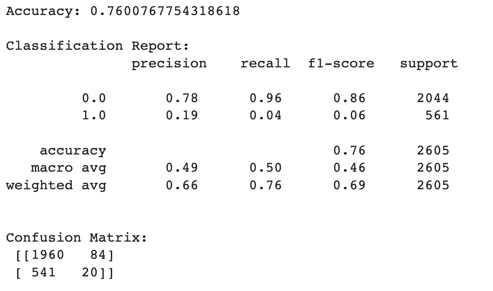
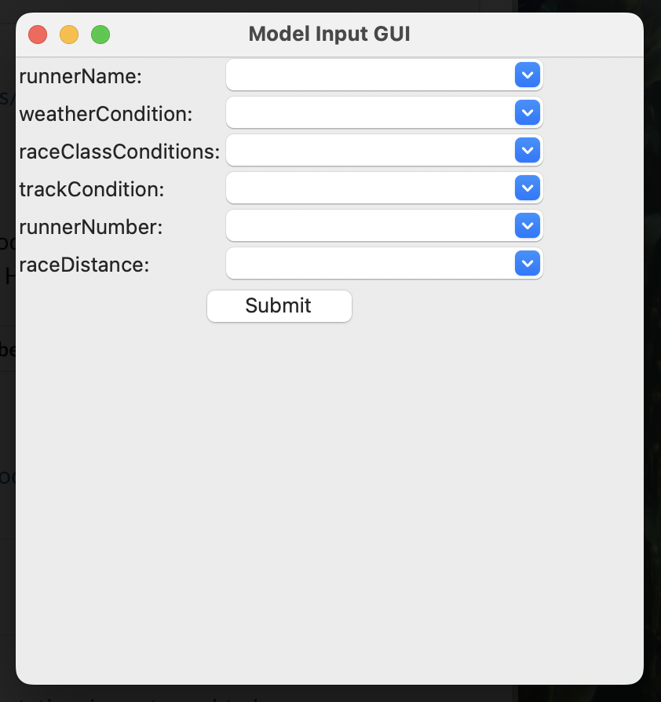
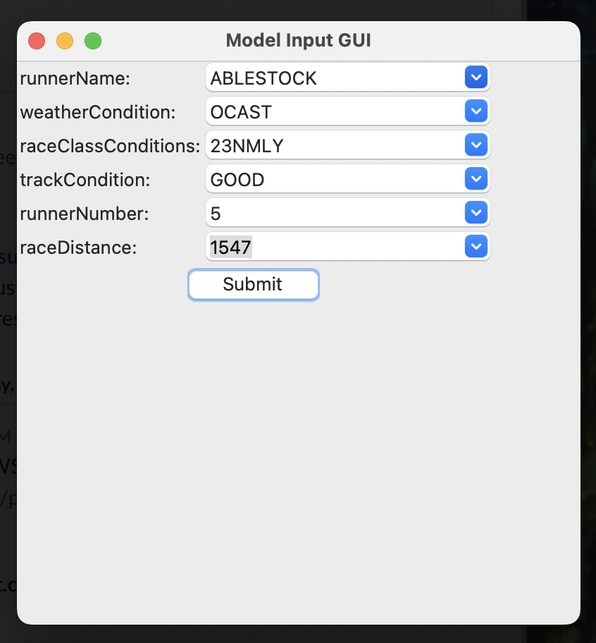
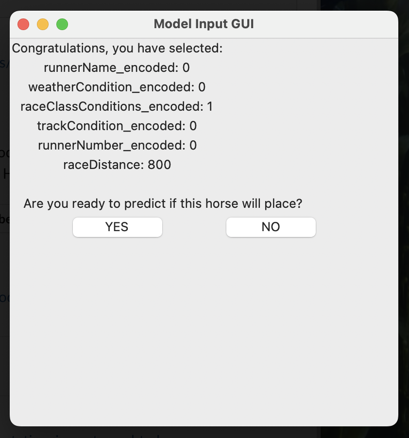
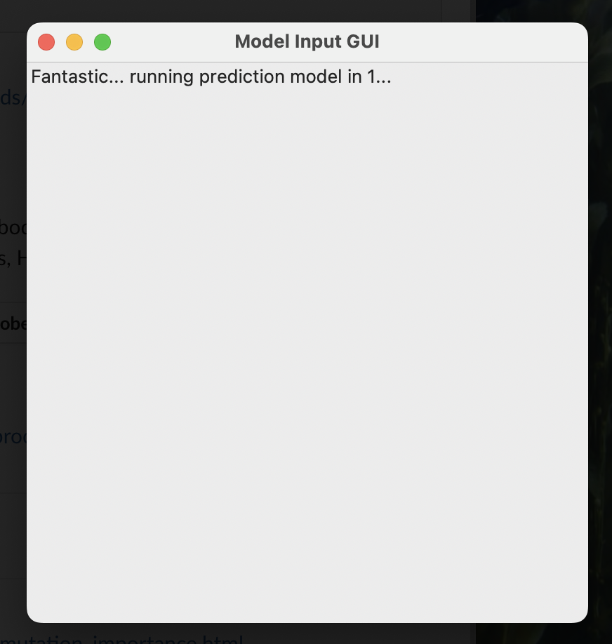
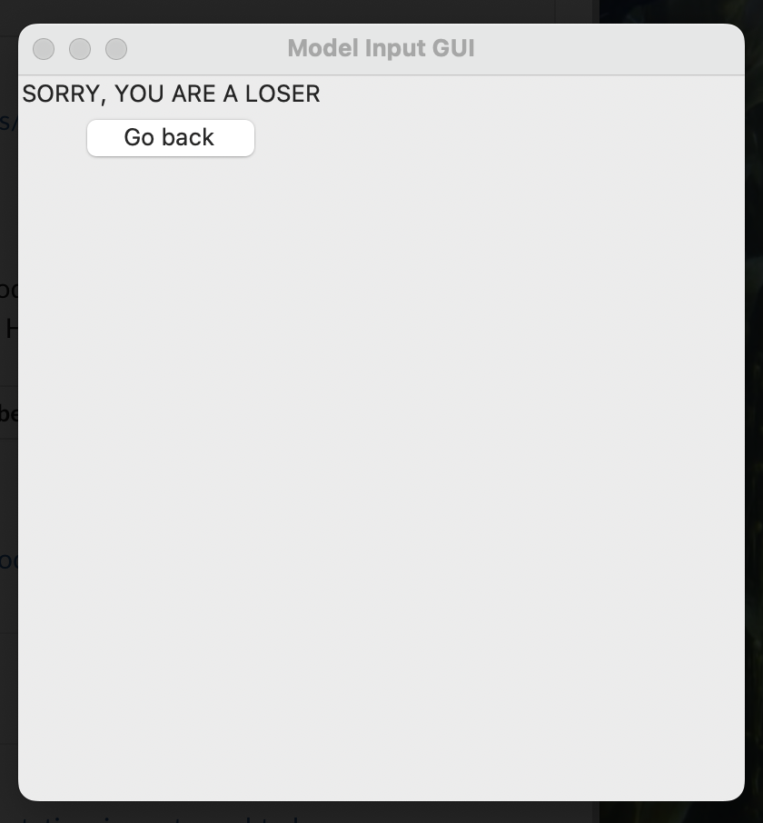

# Punter's Delight - Horse Racing Predictions Using Neural Networks
##### _The Last Betmaker, Ever._ ✨Magic ✨

***

## Project Overview
* The aim of the project is to use neural networks to make predictions on future horse races based on historical data in horse races within Australia. The languages utilised within the final project are predominantly Python with some JS. Libraries utilised are Pandas, HVPlot, SKLearn, MatPlotLib, OS, Seaborn, TensorFlow and Tkinter. There are number of attempts made throughout the project to improve the accuracy, precision and repeatability of the predictive model. 
 
## Table of Contents
1. [Introduction](#introduction)
2. [Initial Project Ideas](#initial-project-ideas)
3. [Dataset Description](#dataset-description)
4. [Data Loading](#data-loading)
5. [Data Cleaning and Wrangling](data-cleaning-and-wrangling)
6. [Model Training](#model-training)
7. [Predictions](#predictions)
8. [GUI](#gui)
9. [Dependencies and Libraries](#dependencies-and-libraries)
10. [Usage](#usage)

## Introduction
The information provided below only describes the method used in one of the notebooks that creates the GUI. 

## Initial Project Ideas
* Betfair API and Amazon Lex Bot
* Amazon Lex Bot and AWS Neural Network
* Amazon Lex Bot and AWS S3 with Defined Neural Network Model
* Local Neural Network Model with Interactive GUI

## Dataset Description

There are approximately 50,000 data points of Australian horse races provided in the CSV file. Each data point is for one horse per race. The data contains not only the status of the horses but also the jockeys and the trainers. Each data point includes the result of the race and the pre racing status such as historical records of the horse, the jockey, and the trainer before the race has started.

For developing machine learning algorithms, you could simply split the data file with 80 (Training)/20 (Testing) or whatever you like. Column 'finishingPosition' represents the result that the horse has run:

'1' means the horse finished at 1st place
'2' means the horse finished at 2nd place
'3' means the horse finished at 3rd place
'4' means the horse finished at 4th place
'0' means the horse finished at out of the first 4 or 3 places
'-2' stands for the horse was scratched
BLANK means the race was abandoned

Data utilised in the training model is found here:
* https://aws.amazon.com/marketplace/pp/prodview-qbh3vyytz6d3s#overview
    * runner_result_runner_result.csv

## Data Loading
The initial step is to import each tables and load them into DataFrame. The read_csv and Path functions are used to read the tables. 

The DataFrame that is used in the training model is spilt and encoded categorical variables into the respective datasets that is used as critical variables in the training model. Encoding was used using sklearn preprocessing LabelEncoder() and saved into a json file.

## Data Cleaning and Wrangling
Encoded DataFrames were concatenated into a single dataframs (X), data was cleaned up, dropped null values and updated columns as strings. 
X was updated into a StandardScaler for the model and use in KMeans. 

Data was split into X_train, X_test, y_train and y_test using train_test_split as changed into an astype(float) ready for model training. 

## Model Training
One training model used from TensorFlow Keras was Sequential. The Neural Network model included 4 Layers (Acivation, 2 Hidden and an Output Layer) utilising Dense. The activation function selected was ReLu on the first three layer and the Sigmoid on the output layer. Compliation of the model used: Binary Crossentropy, ADAM and accuracy. Training modelling used 20 Epochs with batch size 16.

A second model used from SKlearn.ensemble RandomForest. Modelling was used to determine how important variables were in the predictive modelling. 

## Predictions
Final predictions of the model stagnated around 76% through all testing of each model and methods. The outcome of all of this testing is not desirable and will require more in depth analysis and a different approach using different datasets. 

## GUI
A GUI was created to let the user interact with the predictive model based on the race data. 

The landing page of the GUI provides the user with variables to select for the desired race. 

A screenshot of some of the selected variables in the GUI:

Once the user selects the options the GUI will provide a confirmation page.

Once confirmed, that machine predictive analysis will take place:

Finally, the outcome of the analysis will indicate if the user has selected a suitable horse.

## Dependencies and Libraries
* Python 3.11
* Pandas
* Numpy
* Pathlib
* Hvplot
* Sklearn
* TensorFlow

## Usage
Clone the project repository from GitHub.\
Install the required dependencies using pip/conda installs.\
Upload the datasets in the appropriate directory.\
Run the Jupyter notebook or Python script to execute the project steps.\
By completing this project, we have gained valuable experience in using Pandas, etc., to clean, explore, and derive insights from real-world data.
